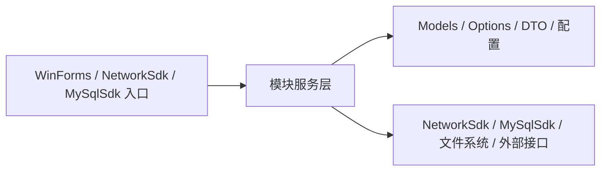
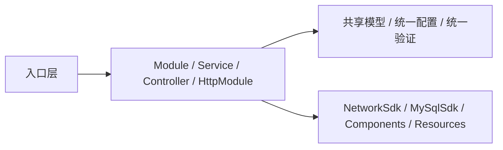
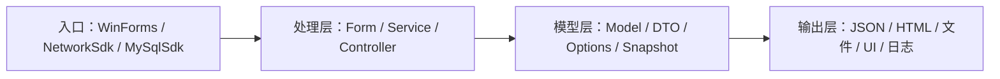
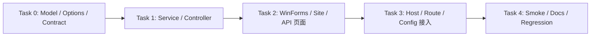

# plan-{{模块名}}-v{{版本}}

> **For agentic workers:** 实施本 Plan 前先加载 `rtk` 和本任务所需的 {{PROJECT_NAME}} skills；按 Task 顺序执行，每完成一个 Task 运行 `rtk dotnet build` 验证，涉及格式、命名或 using 变化时再补 `rtk dotnet format --verify-no-changes`。若涉及 WinForms UI，优先加载 `dotnet-winforms-guidelines`，并按需加入 `winforms-three-section-layout`、`custom-drawn-components`、`winforms-theme-system`、`winforms-mainform-scaffold`。

**Goal:** {{一句话描述本次 Plan 的核心目标}}

**Architecture:** {{2-3 句描述技术方案核心设计}}

**定位：** {{新增功能 / 改造现有功能 / 优化重构}}，{{对其他模块的影响说明}}

---

## 占位符说明

| 占位符 | 含义 | 示例 |
|--------|------|------|
| `{{版本号}}` | Plan 版本 | `v1.0` |
| `{{模块名}}` | 模块目录名（优先沿用仓库现有 PascalCase 命名） | `Iptv` / `FileOnlinePlayer` |
| `{{模型名}}` | 数据模型文件名前缀 | `song` → `SongModels.cs` |
| `{{功能名}}` | 功能、服务、窗体或宿主前缀 | `kugou_music` → `KuGouMusicController.cs` |
| `{{ModelName}}` | 数据模型类名（PascalCase） | `SongDto` / `IptvCatalogSnapshot` |
| `{{FeatureName}}` | 功能类名（PascalCase） | `KuGouMusicController` |
| `{{featureName}}` | 功能变量名（camelCase） | `kuGouMusicController` |

---

## 技术栈

> 完整技术栈、外部依赖、自研基础设施、测试配置详见 tech-stack.md。以下仅列出与 Plan 实施直接相关的选型摘要：

| 类别 | 技术选型 | 说明 |
|------|---------|------|
| **Windows UI** | WinForms + 自研 Theming + 自绘控件 | AppThemedForm 窗体基类、AppButton 自绘按钮、12 语义调色板 |
| **网络请求** | `NetworkSdk` + `HttpClient` | 请求发送、下载、拦截器管线、重试策略 |
| **本地存储** | `MySqlSdk` + `MySqlConnector` / 文件系统 | MySQL 异步客户端、事务、批量写入 |
| **验证** | `rtk dotnet build` / `rtk dotnet test` / `rtk dotnet format --verify-no-changes` | 每个 Task 结束后执行 |

---

## 相关 Skills

| Skill | 用途 | 加载时机 |
|-------|------|---------|
| `rtk` | 所有 shell 命令的公共前缀 | 开始实施前（必需） |
| `dotnet-guidelines` | C# / .NET 编码规范、异步、异常、日志、DI | 开始实施前（核心） |
| `donet-naming` | 文件、命名空间、类型、成员、测试命名 | 涉及命名 / 新文件时 |
| `dotnet-winforms-guidelines` | WinForms 窗体显示、生命周期、关闭、Owner、加载 | 涉及 WinForms 时 |
| `custom-drawn-components` | 自绘控件、Designer-safe 包装、交互与稳定性 | 涉及自绘控件时 |

### Skills 加载决策树

```
开始：分析需求场景
  ├─ 首次接入？ → rtk + dotnet-guidelines
  ├─ 涉及命名/文件？ → donet-naming
  ├─ 涉及 WinForms？ → dotnet-winforms-guidelines → 再判断布局/主题/自绘
  ├─ 涉及 native/领域？ → 对应领域 skill
  └─ 已加载 > 5 个？ → 保留 P0/P1，舍弃 P2/P3
```

**推荐组合：**

| 场景 | 建议 Skills |
|------|------------|
| 新建模块 | `rtk` + `dotnet-guidelines` + `donet-naming` |
| 新建 WinForms 页面 | `rtk` + `dotnet-guidelines` + `donet-naming` + `dotnet-winforms-guidelines` |
| 新建自绘控件或主题 | `rtk` + `dotnet-guidelines` + `custom-drawn-components` |

---

## 一、功能介绍

### 1.1 背景

{{说明为什么要做这个功能，现有什么问题，解决什么痛点。}}

### 1.2 现有架构（如适用）



### 1.3 新增后架构（如适用）



### 1.4 方案核心

{{用一段话概括方案的核心设计思路。}}

### 1.5 功能对比（如适用）

| 维度 | 现在 | 新增后 |
|------|------|--------|
| 入口方式 | {{现状}} | {{改进}} |
| 模型 / 配置 | {{现状}} | {{改进}} |
| UI / 页面 | {{现状}} | {{改进}} |
| 验证方式 | {{现状}} | {{改进}} |

---

## 二、UI 设计

### 2.1 设计稿来源

| 项目 | 说明 |
|------|------|
| **设计平台** | MasterGo / 现有截图 / 无设计稿 |
| **设计稿链接** | `{{链接}}` |

### 2.2 页面截图

**截图存放位置：** `ai/plans/screenshots/{{模块名}}/`

### 2.3 设计规范映射

| 设计属性 | {{PROJECT_NAME}} 实现 | 说明 |
|---------|---------------------|------|
| 颜色 | `AppThemePalette` 语义属性 | WinForms 与站点分别映射 |
| 字体 | `Font` / CSS `font-family` | 各自实现 |
| 间距 | `Padding` / `Margin` / `Dock` / `TableLayoutPanel` | 统一布局骨架 |
| 圆角 | 自绘路径 / CSS `border-radius` | 分别处理 |
| 组件 | `Components/Composite/` 自绘控件 | 优先复用项目控件 |

**WinForms 额外约束：**
- 三段式窗体外壳统一使用 `AppThemedForm` + `TableLayoutPanel` 根布局
- 列表型视图优先使用自绘控件，参考 `Components/Composite/`

---

## 三、数据模型设计

### 3.1 数据流向



### 3.2 模型与配置约定

- DTO、Request、Response 一律 PascalCase，按 `donet-naming` 规则命名
- JSON 序列化优先 `System.Text.Json`，偏差时用 `[JsonPropertyName]`
- 配置类统一以 `Options` 结尾
- 跨模块共享契约放 `Models` / `Contracts` / `Options`，不散落页面代码
- NetworkSdk 返回值封装为 `NetworkResponse<T>`
- MySqlSdk 模型需明确连接配置、事务边界与批量写入策略

---

## 四、SDK 与配置（如涉及）

- NetworkSdk：`INetworkClient` + `NetworkClientBuilder` + `AddNetworkClient()` DI 注册
- MySqlSdk：`IMySqlClient` + `AddMySqlSdk()` DI 注册 + `MySqlSdkOptions`
- 配置入口：`Program.cs` / `{{PROJECT_NAME}}.settings.json` / `*Options.cs`

---

## 五、实施阶段

### 依赖关系



### Task {{编号}}：{{任务名称}}

**Files:**
- Create/Modify: `{{文件路径}}`

**✅ 验收检查点：**

| # | 检查项 | 验证方式 |
|---|--------|---------|
| 1 | {{检查项}} | {{验证方式}} |

- [ ] **Step 1: {{操作描述}}**
- [ ] **Step 2: 运行构建验证**

```bash
rtk dotnet build
```

- [ ] **Step 3: 运行格式验证（如涉及 using / 命名调整）**

```bash
rtk dotnet format --verify-no-changes
```

- [ ] **Step 4: 手动 smoke（如涉及宿主 / UI / API）**

### Task 参考示例

> 以下为常见 Task 类型的参考示例，参考完整版 plan-template-dotnet.md 获取详细代码示例。

- **示例 A：创建数据模型 / DTO / Options** — 参考完整版
- **示例 B：创建业务 Service / Provider / Client** — 参考完整版
- **示例 C：创建 WinForms 页面 / 窗体** — 参考完整版
- **示例 D：共享静态资源 / 图片 / 图标** — 参考完整版
- **示例 E：API 定义（NetworkSdk 请求）** — 参考完整版
- **示例 F：SDK 配置 / DI 注册** — 参考完整版
- **示例 G：自绘控件列表 / 表格维护页** — 参考完整版

---

## 六、测试计划

- 本地构建：`rtk dotnet build`
- 格式检查：`rtk dotnet format --verify-no-changes`
- 单元测试：`rtk dotnet test`
- WinForms smoke：启动程序，检查窗体打开/关闭/加载态/空态/错误态/主题
- SDK smoke：调用接口，检查请求/响应/重试/超时/日志
- 配置 smoke：修改 settings.json 后确认热生效/需重启字段
- 回归范围：明确本次改动影响的模块、共享控件、入口与配置项

---

## 七、附录

### A. 文件清单

| 文件路径 | 操作 | 说明 |
|----------|------|------|
| `{{PROJECT_NAME}}/{{模块名}}/Models/{{模型名}}.cs` | 新增/修改 | DTO / Options |
| `{{PROJECT_NAME}}/{{模块名}}/Services/{{功能名}}Service.cs` | 新增/修改 | 业务服务 |
| `{{PROJECT_NAME}}/Ui/{{模块名}}/{{FeatureName}}Form.cs` | 新增/修改 | WinForms 页面 |
| `{{PROJECT_NAME}}/Components/Composite/*` | 新增/修改 | 自绘控件 |
| `{{PROJECT_NAME}}.settings.json` | 修改 | 运行时配置 |

### B. 已确认的决策记录

| # | 决策 | 结论 | 日期 |
|---|------|------|------|
| {{编号}} | {{决策}} | {{结论}} | {{日期}} |

---

## 当前阶段跟踪

| 阶段 | 状态 | 开始时间 | 完成时间 | 备注 |
|------|------|---------|---------|------|
| 阶段 0 | {{未开始 / 进行中 / 已完成}} | {{YYYY-MM-DD}} | {{YYYY-MM-DD}} | {{备注}} |

**Task 完成清单：**

- [ ] Task 0: {{任务名称}}
- [ ] Task 1: {{任务名称}}

**当前进行阶段：** 阶段 {{编号}} - {{阶段名称}}

---

**创建时间**：{{YYYY-MM-DD HH:mm:ss}}
**状态**：{{规划中 / 实施中 / 已完成 / review 中 / review 打回 / 已废弃}}
**关联 Review**：{{reviews/review-vX.X.X.md}}
