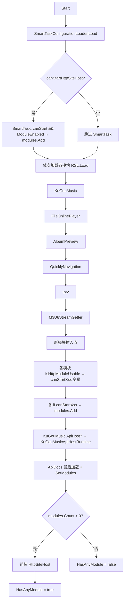

# Program.SiteHost.cs 接入步骤

## 前置条件

已完成：后端三件套 + 配置注册（SettingsFile 五步）。

---

## 步骤 1：添加 using 声明

**文件：** `{{PROJECT_NAME}}/Program.SiteHost.cs`

**位置：** 顶部 using 区

**操作：** 新增一行

```csharp
using {{PROJECT_NAME}}.Api.{{模块名}}.Hosting;
```

**定位锚点：** 在 `using {{PROJECT_NAME}}.Api.M3U8StreamGetter.Hosting;` 之后添加。

---

## 步骤 2：三段式集群插入

新模块代码必须按三段式集群模式插入，保持与现有模块一致的代码结构。

### 段1 — RSL.Load 集群

**位置：** 在 `var m3u8StreamGetterSettings = M3U8StreamGetterRuntimeSettingsLoader.Load();` 之后

```csharp
var {{模块名小驼峰}}Settings = {{模块名}}RuntimeSettingsLoader.Load();
```

### 段2 — canStart 布尔变量集群

**位置：** 在 `var canStartM3U8StreamGetterHttpModule = canStartHttpSiteHost && M3U8StreamGetterRuntimeSettingsLoader.IsHttpModuleUsable(m3u8StreamGetterSettings);` 之后

```csharp
var canStart{{模块名}}HttpModule = canStartHttpSiteHost &&
                                   {{模块名}}RuntimeSettingsLoader.IsHttpModuleUsable({{模块名小驼峰}}Settings);
```

### 段3 — modules.Add 集群

**位置：** 在 `modules.Add(new M3U8StreamGetterHttpModule(m3u8StreamGetterSettings.HttpModule));` 的 `if` 块之后

```csharp
if (canStart{{模块名}}HttpModule)
{
    modules.Add(new {{模块名}}HttpModule({{模块名小驼峰}}Settings.HttpModule));
}
```

---

## 关键约束

- **ApiDocs 必须最后加载**：新模块绝不能插入在 ApiDocs 的 RSL.Load / canStart 变量 / modules.Add 之后
- **canStartHttpSiteHost 门控**：所有 `canStart{{模块名}}HttpModule` 变量必须包含 `canStartHttpSiteHost &&` 前缀
- **三段式集群完整性**：RSL.Load + canStart 变量 + modules.Add 三段缺一不可

---

## Program.SiteHost.cs 启动流程图


